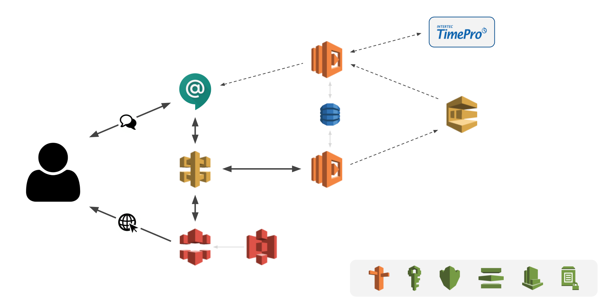
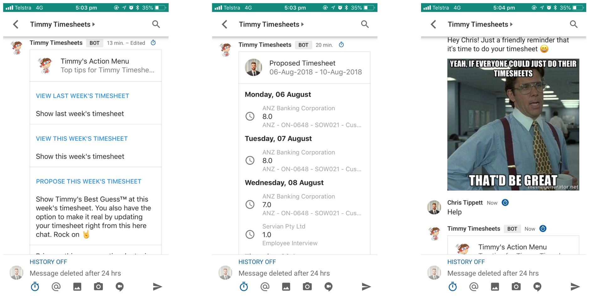

Timmy Timesheets
================

Timmy Timesheets is a Hangouts Chat bot (for now) that automatically reminds Servian consultants to submit their timesheet.

But that's not all... Timmy also integrates with Google Calendar and looks at your previous timesheets to come up with what it thinks your timesheet for this week should be. That's right, **Timmy can fill out your timesheet for you**.

Solution
--------

Timmy was built during an AWS-themed hackathon, so all Timmy's parts were built using AWS services.

**Timmy's anatomy:**
- Messages to Timmy are sent to a webhook hosted by a Lambda function
- Timmy responds to each message via the Lambda function's HTTP response. **However...**
- Some of Timmy's tasks take a bit of time to complete (e.g. scraping timesheet data). Instead of delaying Timmy's response, long-running tasks are sent to an SQS queue to be processed by a different Lambda function - this allows Timmy to respond straight away while the task is processed in the background
- When a long-running task completes, we want Timmy to be able to update the user via a new message. We do this by sending an asynchronous message to the user using the Hangouts Chat API

**Other notes:**
- Timmy's conception is entirely automated through Terraform
- All configuration is stored in AWS Systems Manager Parameter Store (this includes data output from Terraform)
- All user data is stored in DynamoDB
- API Gateway is used to front the Lambda functions hosting Timmy's chat webhook and the frontend API
- Static website is stored in S3 and fronted by CloudFront
- Custom domain for Timmy's API and the website are managed by Route53
- SSL certificates provisioned through AWS Certificate Manager
- Separate KMS keys for each service

Timmy in action
---------------

